# CSE 151A Final Project Report

## Introduction
Skin cancer is a prevalent and potentially life-threatening disease that affects millions of people worldwide. Early detection and accurate diagnosis are crucial for effective treatment, as they can significantly improve the chances of curing the cancer before it spreads to other parts of the body. In recent years, the field of medical image analysis has seen rapid advancements, particularly in the application of machine learning and deep learning techniques for disease classification. These technologies offer the potential to assist dermatologists in identifying malignant skin lesions with high accuracy, thereby enhancing clinical decision-making and patient outcomes.

This project is particularly important due to the fact that it explores the implementation of different models to classify early detection of skin cancer from dermascope images. Here we will discuss the technical methodologies employed, including data augmentation techniques, model architecture choices, and evaluation metrics. Furthermore, this report addresses the challenges encountered within our project, such as data imbalance and model robustness, and analyzes the potential solutions  we attempted to enhance the performance and reliability of the models. Our project aims to contribute to the broader effort of improving early diagnosis and treatment outcomes for patients with skin cancer.

## Methods
### Data Collection and Exploration
Our first data set came from The ISIC 2024 Skin Cancer Detection with 3D Total Body Photos (TBP) dataset from a kaggle competition. Our initial data exploration focused primarily on the metadata associated with the images. This approach allowed us to survey the full dataset in terms of feature analysis without the need to parse and analyze the features of all the images. We will be able to identify trends in features we expect to analyze as well as provide us with an understanding of biases that may exist in the dataset. 

To begin with, we plotted the distributions of the most critical features to understand the existing trends or biases. An immediate observation was a significant gender imbalance, with notably more males than females in the dataset. Based on literature from the American Academy of dermatology this imbalance, however, is likely irrelevant towards the analysis of our dataset for the purpose of diagnosis. 

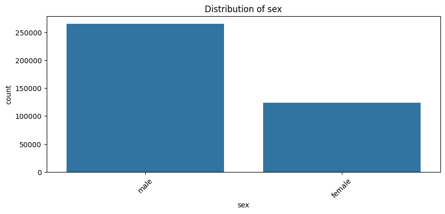
Fig 1: Gender distribution of ISIC 2024 dataset showing higher male over female bias

Furthermore, we observed that most samples in the data are from regions outside the head. This indicates that the head is underrepresentation might pose a challenge for our model in predicting lesions in the head area. However it is important to note that this is an expected consequence of the type of data we are taking, Comparatively there are less spots/ lesions on the head and neck compared to the rest of the body, but when they exist they account for around 20-30% of all melanoma cases, thus, we address this imbalance as part of our class imbalance which will be discussed below. 

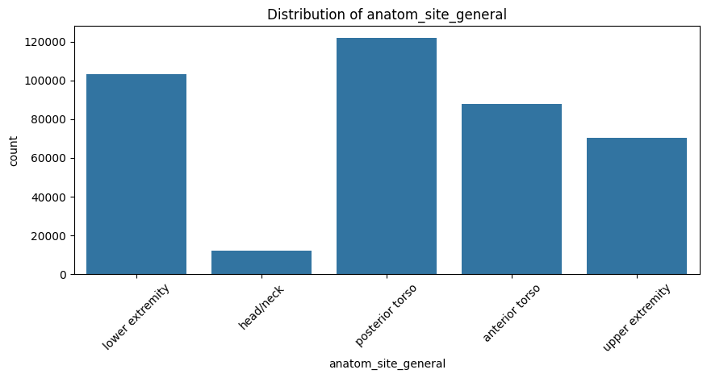
Fig 2: Anatomical site of all skin lesions

Continuing we wanted to understand the amount of malignant data we have as it is known that a big challenge with skin cancer datasets is the class imbalance. Out initial 2024 dataset was severely imbalance with only 

The International Skin Imaging Collaboration (ISIC) provides several publicly available datasets that are widely used for research in skin lesion analysis, particularly for the classification of skin cancer.

Here's a summary of all the ISIC datasets we used:

1. **ISIC 2016 Dataset**
    - Description: This dataset was part of the ISIC 2016 Challenge and includes dermoscopic images of various skin lesions.
    - Content: It contains 1,279 images categorized into three classes: melanoma, nevus, and seborrheic keratosis.
    - Objective: The challenge aimed to benchmark automated algorithms for skin lesion segmentation and classification.

2. **ISIC 2017 Dataset**
    - Description: Released for the ISIC 2017 Challenge, this dataset includes dermoscopic images with annotated lesion boundaries.
    - Content: It comprises 2,000 images with three main classes: melanoma, nevus, and seborrheic keratosis. It also includes ground truth segmentations for training purposes.
    - Objective: The challenge focused on two main tasks: lesion segmentation and classification.

3. **ISIC 2018 Dataset**
    - Description: This dataset was used for the ISIC 2018 Challenge, significantly expanding the number of images and classes.
    - Content: It includes over 10,000 dermoscopic images categorized into seven classes: melanoma, melanocytic nevus, basal cell carcinoma, actinic keratosis, benign keratosis, dermatofibroma, and vascular lesions.
    - Objective: The challenge tasks included lesion segmentation, lesion attribute detection, and disease classification.

4. **ISIC 2019 Dataset**
    - Description: The ISIC 2019 Challenge dataset continued to build on the previous datasets, focusing on more diverse and challenging cases.
    - Content: This dataset contains around 25,000 images classified into eight diagnostic categories, with an additional class for "other" (rare) lesions.
    - Objective: The challenge primarily focused on multi-class classification and lesion diagnosis.

5. **ISIC 2020 Dataset**
    - Description: The ISIC 2020 Challenge dataset is one of the most recent and comprehensive datasets released.
    - Content: It includes 33,126 dermoscopic images labeled for melanoma and "other" classes. The dataset is part of the Kaggle competition and includes additional metadata such as patient age and sex.
    - Objective: The challenge aimed to improve the accuracy of melanoma detection, particularly in distinguishing melanoma from other benign lesions.

**Key Features Across Datasets:**
- High-Resolution Images: All datasets provide high-quality dermoscopic images, essential for accurate lesion analysis.
- Metadata: Many images come with expert annotations, including lesion boundaries and diagnostic labels.

While exploring, we noticed that the 2024 dataset is just a subset of all the above, so we just combined them. This table presents them in a more condensed form:

| ISIC Data Set | Number of benign | Number of melanoma | Total |
|---------------|------------------|--------------------|-------|
| 2020 Training | 32542            | 584                | 33126 |
| 2019 Training | 20809            | 4522               | 25331 |
| 2018 Training | 8902             | 1113               | 10015 |
| 2018 Test     | 1341             | 171                | 1512  |
| 2018 Validation| 172             | 21                 | 193   |
| 2017 Training | 1626             | 374                | 2000  |
| 2016 Training | 726              | 173                | 899   |
| 2016 Test     | 726              | 173                | 899   |
| **Final set** | **55991**        | **5532**           | **61523** |
Table 1: In depth review of available data to aid with class imbalance
*Note: This final set is after removing duplicates. Furthermore, while training, after splitting, all melanoma examples are used but not all benign examples due to computing restrictions. They are randomly chosen.*

For more in depth EDA we opted to explore further, using a correlation matrix and corresponding dendrogram that showed us closely related traits. While this information was not particularly useful in the overall design of our model as we would not be able to extract many of these metrics as independent features (like thickness, diameter, perimeter, etc.), it still showed us what biological traits were closely related. It also gave us insight into what features might be worth focusing on or prioritizing our model towards. 

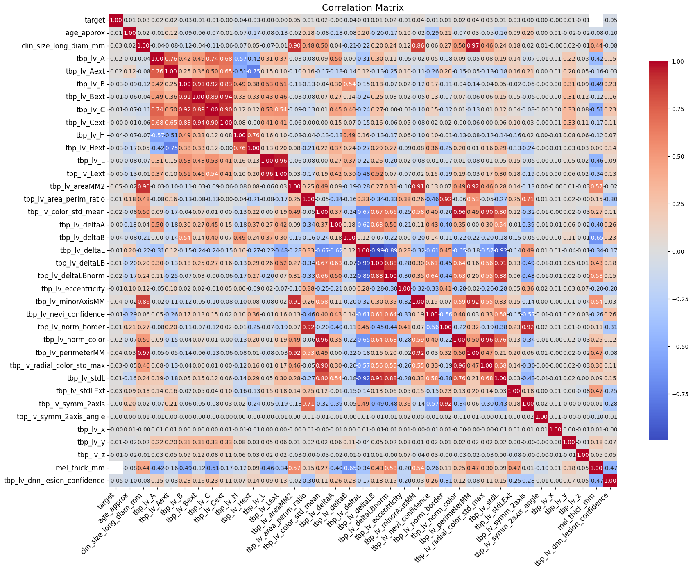
Figure 3: Correlation matrix of metadata so help understand correlations of our metadata. We note that the target variable has low correlation values with most features, suggesting weak linear relationships or complex non-linear relationships with the predictors.

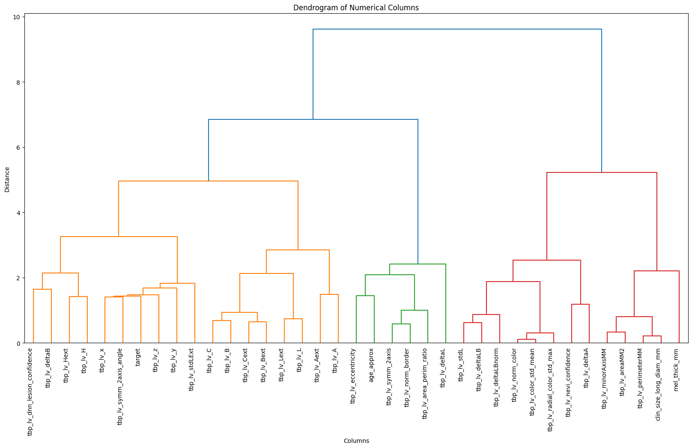
Fig 4: Dendrogram where the vertical axis represents the distance or dissimilarity between clusters. The height at which two branches merge indicates the distance between the merged clusters. Larger distances imply less similarity between the merged groups.

The pairplot further elaborates on this information by showing us which biological features are most correlated with one another. If a lot of strongly weighted features are strongly correlated or if a lot of weakly weighted features are strongly correlated, it could hint at some relevant features we can artificially weight with stratification or pre-processing (i.e., if the color data is found to be relatively irrelevant, pre-processing the data to use grayscale would help prevent fitting the model to data that could throw it off).

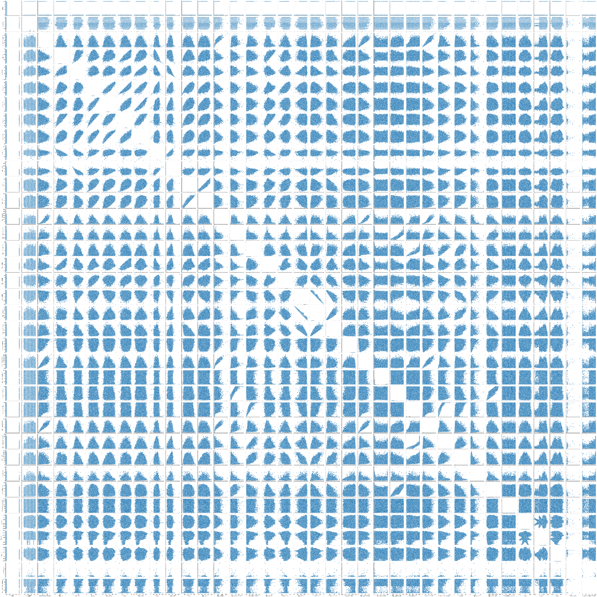
Fig 5: Pair plot (Larger and easier to read version included in our github repository)
While the Correlation Matrix and Dendrogram do a better job of easily displaying the strongest correlations across features, the pairplot also shows us how different features could be correlated and what types of correlations to expect.

Finally, our last EDA process was loading and visualizing the images.

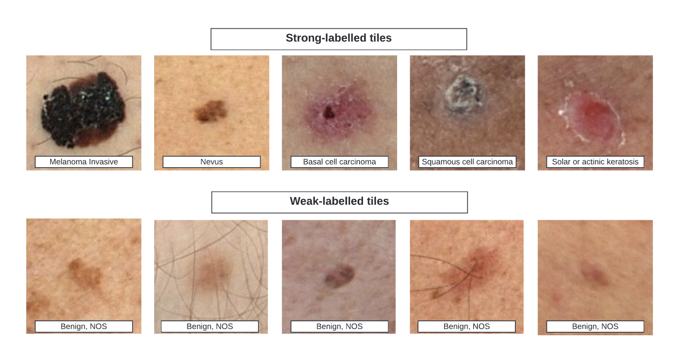
Fig 6: Example of all the different skin lesions available in the dataset 

### Preprocessing
#### Affine Transformations
Through EDA we have seen that there is a great class imbalance which we've mitigated some of the problem by adding more malignant examples as shown above. However, there still is a big ratio imbalance. In turn, we applied affine transformations to our images using the Keras `ImageDataGenerator` which makes batches of tensor image data with real-time data augmentation. More simply, it will create a variation of data. We implemented transformations such as rotation, brightness, shear, zoom in, and reflection.

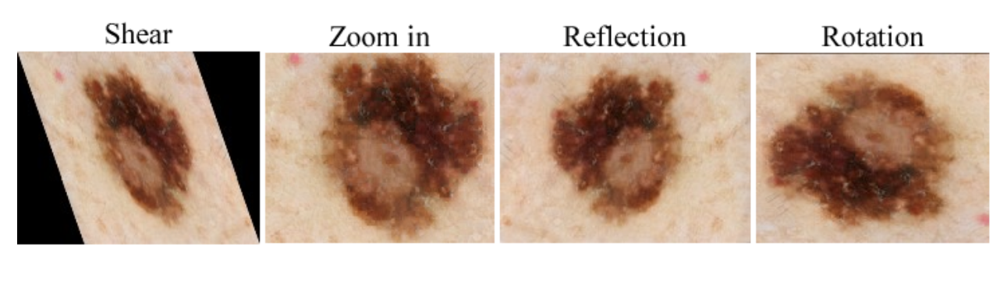
Fig 7: Same image after different types of affine transformations

We also implemented image preprocessing steps such as resizing images to fit the input requirements of different models and normalizing the pixel values.

#### Hair Removal Techniques
We applied several methods for hair removal, including morphological operations and interpolation techniques. The morphological operations involved the use of a morphological closure, which helps in eliminating thin and elongated structures such as hair. After identifying these structures, we used interpolation to reconstruct the image areas where hair was removed, ensuring minimal loss of critical lesion information.

**Figure 7** illustrates the various steps in our hair removal process:

1. **Original Image**: The initial dermoscopic image with visible hair artifacts.
2. **Grayscale Image**: Conversion to grayscale to simplify the analysis and processing.
3. **Morphological Closure**: Application of morphological operations to identify hair structures.
4. **Thin and Long Structures**: Extraction of hair structures from the image.
5. **Interpolated Image**: The final image after hair removal and interpolation, ready for further analysis and model input.

#### Morphological Closure
Morphological Closure combines two operations to smooth the contours of objects, close small holes, and connect nearby objects. The process is as follows:

- **Dilation**: Applied to the image to expand the boundaries of objects. This can help merge or close small gaps and holes within objects. Dilation is an operation that adds pixels to the boundaries of objects in an image.
- **Erosion**: Applied to the dilated image. Erosion is an operation that removes pixels from the boundaries of objects. This step reduces the expanded regions back down, but the previously closed gaps or holes remain closed because they were not large enough to be reopened by the erosion process.

Both these operations were done using the OpenCV library. We were not entirely successful, however, since this operation did diminish the quality of our images, so it could not be widely applied without hindering the fidelity of the dataset.

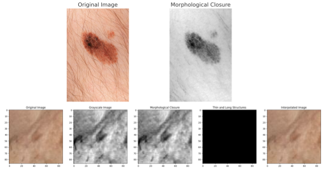
Fig 8: Examples of attempted hair removal processes. Overall we were able to successfully remove hair from the dataset

### Model 1 Architecture (ResNet):

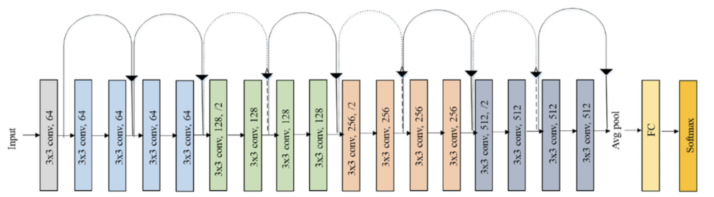
Figure 9: A Visualization of Resnet18’s Model Architecture (sourced from https://link.springer.com/article/10.1007/s10916-019-1475-2)

Our initial model used the ResNet18 pre-trained model as a baseline. The model has a unique architecture consisting of a Convolutional input layer, a set of 64 filter residual blocks, a set of 128 filter residual blocks, a set of 256 filter residual bocks, a set of 512 filter residual blocks, an average pooling layer, and a fully connected output layer for classification. The cornerstone of the Resnet18 Architecture is the core focus on Residual Learning. Residual learning focus on the layers being able to learn their respective residual functions over the traditional unreferenced functions that other machine learning architectures focus on. The goal of this design choice is the idea that it should be easier for the layers to learn the residual function (which is rooted in the input identity) than the unreferenced function from scratch. Additionally, residual learning approaches have been shown to be generally less susceptible to the vanishing gradient problem than other approaches. 

This model was chosen for its well-established performance and efficiency, making it an ideal starting point for benchmarking. It is a well-regarded model with a wide pre-training dataset, strong benchmarks, generalized nature, and efficient runtime. More specific/niche models could be implemented based on the observed performance here.  For our model specific processing, we utilized simple steps of converting to a PIL, resizing to ResNet’s preferred resolution, transforming to tensor and normalization. The intent with utilizing a fairly generalized/standard approach is to more quickly and conveniently identify shortcomings in our pre-processing, architecture, hyperparameters, etc. without having to worry about any confounding variables that might be affecting them due to the model we utilized. ResNet18 was chosen as our first step because of its simplicity and well-rounded performance for various image analysis tasks. 

### Model 2 Architecture (Custom CNN):
In our project, we implemented a custom Convolutional Neural Network (CNN) to classify skin lesions from dermoscopic images. The model consists of several convolutional layers, followed by pooling layers, a flattening layer, and fully connected dense layers. Here is a detailed breakdown of the model's architecture:

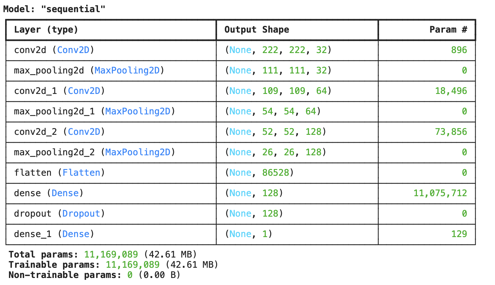
Figure 8: Custom CNN summary that explains the model architecture layers.

The model architecture is designed in an attempt to capture the spatial hierarchies in dermoscopic images through  multiple convolutional layers to learn complex features. The use of dropout layers helps in mitigating overfitting by randomly dropping neurons during training, making the model more robust. 

### Model 3 Architecture (InceptionV3 ImageNet Transfer):
The model architecture used in this study employs a transfer learning approach, leveraging a pre-trained model from the ImageNet dataset as a base. We attempted this model in order to test, transfer learning for a smaller dataset compared to the full dataset of models 1 and 2. The process involves the following key components and steps:

1) Base Model (Pre-trained Network):
    - Selection of Pre-trained Model: The base model selected for transfer learning is a deep convolutional neural network (CNN) called InceptionV3 which is pre-trained on the ImageNet dataset. This model is known for its robust feature extraction capabilities, having been trained on a diverse set of images across thousands of categories.
    - Pre-trained Layers: The lower layers of the pre-trained model are retained as they capture generic features such as edges, textures, and patterns, which are useful across different image recognition tasks.

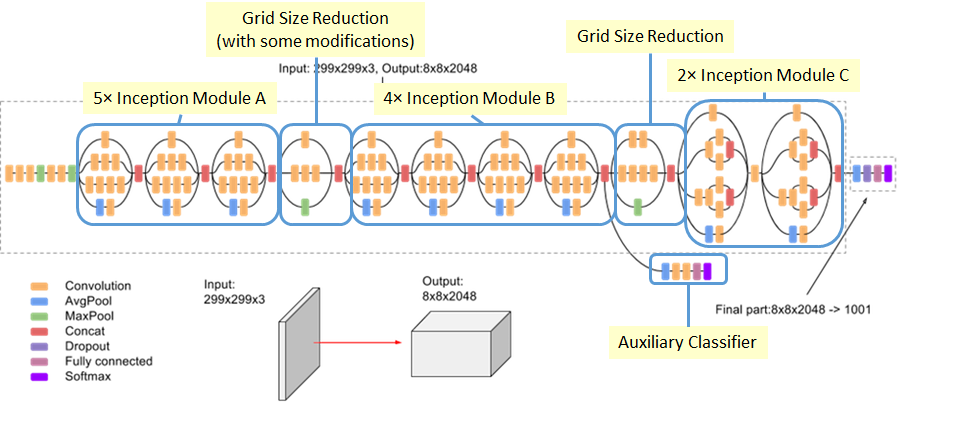
Figure : Graphic describing the structure of Inception V3 architecture. It  is a deep neural network with around 48 layers. The network employs "Inception modules," which are building blocks designed to efficiently capture different levels of features. These modules use multiple filters of varying sizes (1x1, 3x3, 5x5) in parallel to extract features from different scales and then concatenate the outputs. This approach helps in capturing fine details as well as more abstract patterns in the images.

2) Custom Head for Skin Lesion Classification:
    - Flattening Layer: The output from the last convolutional layer of the base model is flattened to transform the feature maps into a single-dimensional vector.
    - Fully Connected (Dense) Layers:
        - A series of dense layers are added on top of the flattened layer. These layers are designed to further process the extracted features and learn task-specific representations.
        - Activation functions such as ReLU (Rectified Linear Unit) are typically used in these layers to introduce non-linearity and allow the model to learn complex patterns.
    - Dropout Layers: To prevent overfitting, dropout layers are included. These layers randomly deactivate a fraction of the neurons during training, forcing the network to learn redundant representations and improving generalization.
    - Output Layer: The final dense layer serves as the output layer, with a number of neurons corresponding to the number of classes in the classification task (e.g., 2 neurons for binary classification: benign and malignant). A softmax activation function is used to output probabilities for each class.

3) Fine-Tuning:
    - Freezing and Unfreezing Layers: Initially, the lower layers of the base model are frozen to prevent their weights from being updated during training. This allows the model to use the general features learned from ImageNet. As training progresses, some of these layers may be unfrozen to fine-tune the network, allowing the model to adapt more specifically to the new dataset (skin lesion images).
    - Learning Rate Adjustment: Fine-tuning often involves using a smaller learning rate to avoid large updates that could disrupt the pre-trained weights, ensuring that the model learns slowly and steadily from the new data.

4) Training and Optimization:
    - The model is trained using a suitable optimizer (e.g., Adam or SGD) and loss function (e.g., categorical crossentropy for multi-class classification).
    - The training process includes monitoring performance metrics like accuracy and loss on a validation set, and employing early stopping based on these metrics to prevent overfitting.

## Results

### Evaluation Metrics:
To evaluate the performance of our models, we used metrics such as accuracy, precision, recall, F1-score, and the area under the receiver operating characteristic curve (AUC-ROC). These metrics provide a comprehensive view of the model's ability to correctly classify benign and malignant lesions. Note that we use training epochs as our measure of model complexity in order to analyze the fitting graphs as shown in class. Thus each of our loss graphs is used to reference the fitting graphs. 

### Model 1 Results (ResNet):

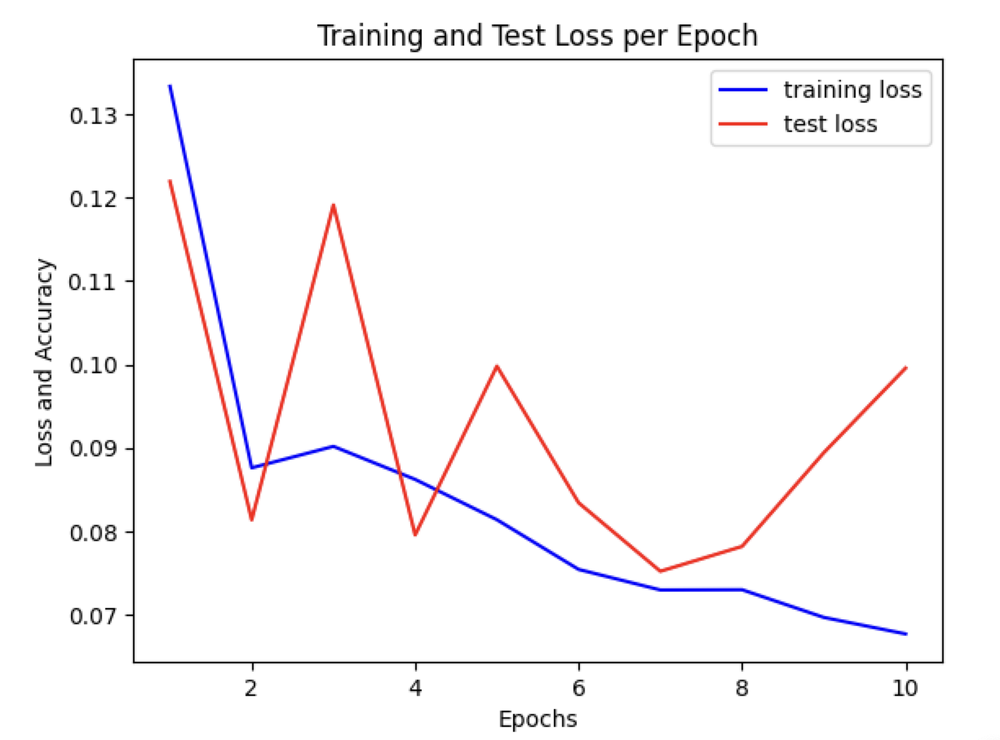
Figure 9: Here we have the loss of our ResNet Model

Given the results of the training and test loss after 10 epochs, it appears that the we overfitted the data as we have the lowest loss in our 10 epochs occur during epoch 7 for the test set, however, after epoch 7 the loss for the test set at epoch 10 is closer to where it was at epoch 5, much greater than our best loss during epoch 7. Our training loss decreased overall by more than 50% after 10 epochs. 

| Epoch | Loss   | Accuracy | Validation Loss | Validation Accuracy |
|-------|--------|----------|-----------------|---------------------|
| 1     | 0.1314 | 0.9624   | 0.1063          | 0.9734              |
| 2     | 0.0936 | 0.9738   | 0.1292          | 0.9696              |
| 3     | 0.0815 | 0.9762   | 0.0865          | 0.9727              |
| 4     | 0.0783 | 0.9764   | 0.0876          | 0.9764              |
| 5     | 0.0863 | 0.9736   | 0.0850          | 0.9727              |
| 6     | 0.0711 | 0.9786   | 0.0930          | 0.9718              |
| 7     | 0.0768 | 0.9735   | 0.0820          | 0.9731              |
| 8     | 0.0711 | 0.9775   | 0.0828          | 0.9693              |
| 9     | 0.0748 | 0.9761   | 0.0798          | 0.9724              |
| 10    | 0.0626 | 0.9791   | 0.0818          | 0.9756              |
Table 2: Accuracy and loss over Epochs

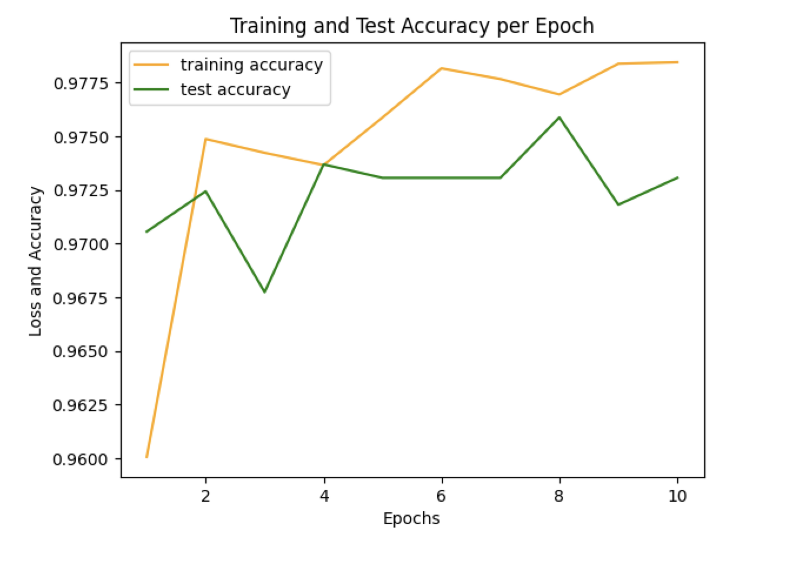
Figure 10: Here we have the accuracy of our ResNet Model

### Model 2 Results (Custom CNN):

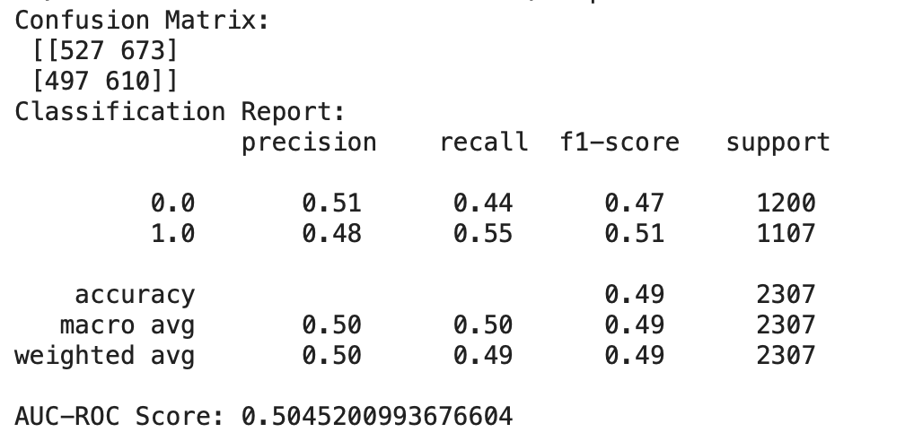
Figure 11: Here we have the Confusion Matrix and Classification Report of our CNN Model

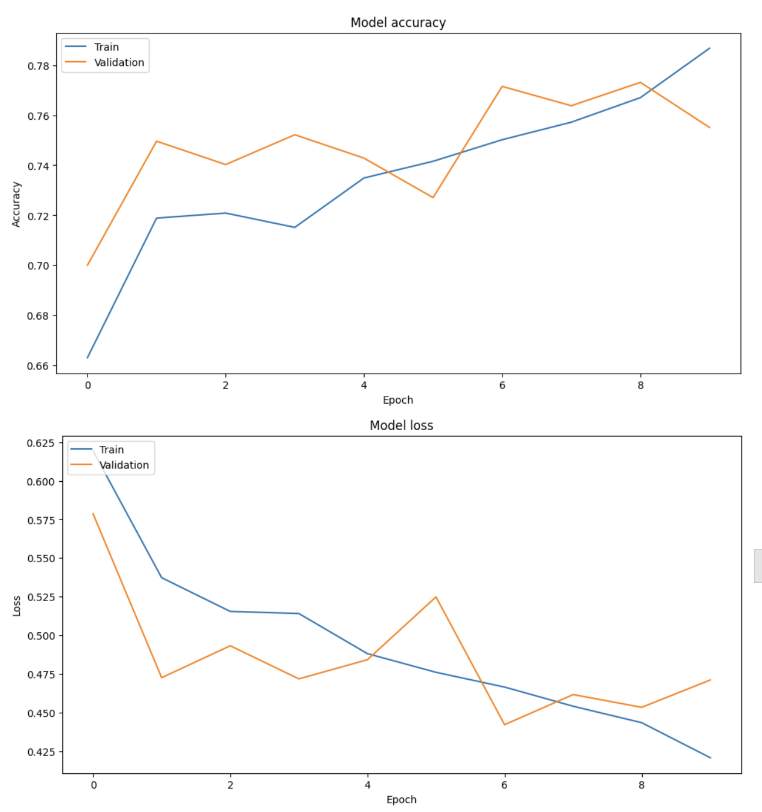
Figure 12: Here we have the Accuracy and Loss of our CNN Model

Based on the figures above see the following results:

**Confusion Matrix**
- **True Positives (TP)**: 610
- **True Negatives (TN)**: 527
- **False Positives (FP)**: 673
- **False Negatives (FN)**: 497

**Classification Metrics**
Precision:
- Class 0 (benign): 0.51
- Class 1 (malignant): 0.48

Recall:
- Class 0: 0.44
- Class 1: 0.55

F1-Score:
- Class 0: 0.47
- Class 1: 0.51

Accuracy: 0.49

AUC-ROC Score: 0.5045

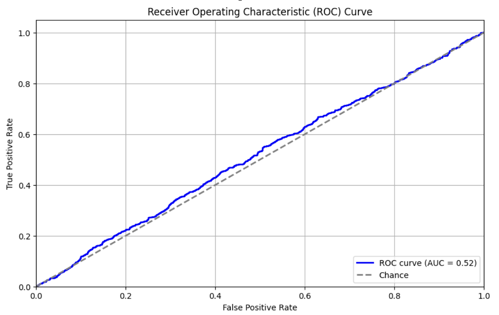
Figure 13: Here we have the ROC Curve of our CNN Model

### Model 3 Results (Inception V3 ImageNet Transfer)

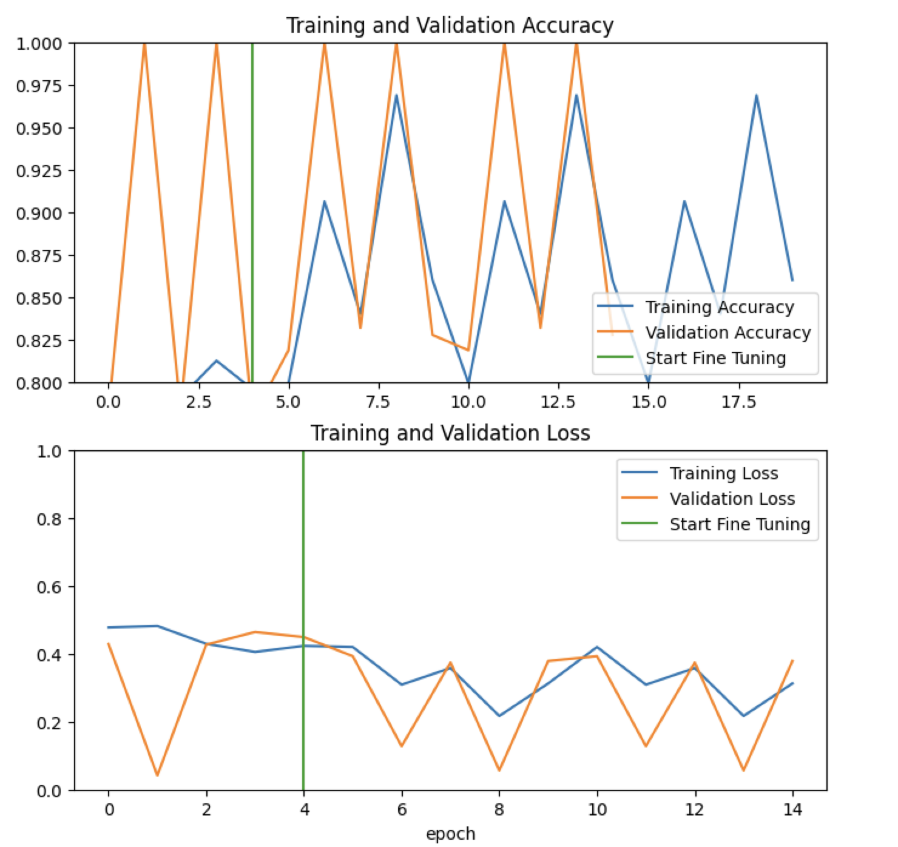
Figure 14: Here we have the Training and Validation Accuracy of our Transfer Model

**Training and Validation Accuracy**
1) Initial Training Phase
    - Training Accuracy: The training accuracy fluctuates significantly, starting from around 0.80 and varying widely up to nearly 1.0 across different epochs.
    - Validation Accuracy: The validation accuracy also shows high variability, ranging from below 0.80 to 1.0. 
2) Fine-Tuning Phase (Epoch 5 onwards):
    - After the fifth epoch, where fine-tuning begins (indicated by the green vertical line), both training and validation accuracies continue to fluctuate. However, the range of variability remains high, and no clear trend towards improvement or stabilization is evident.

**Training and Validation Loss**
1) Initial Training Phase
    - Training Loss: The training loss shows some decrease over time, suggesting that the model is learning. However, like the accuracy, it also exhibits fluctuations.
    - Validation Loss: The validation loss, while generally decreasing, also fluctuates significantly. There is no consistent trend indicating a stable improvement in the model's ability to generalize to unseen data.
2) Fine-Tuning Phase:
    - The fluctuations in both training and validation loss continue after fine-tuning starts. The validation loss does not show a significant drop, which indicates that the fine-tuning may not be providing substantial improvements.

## Discussion

### Interpretation of Results

#### Model 1 Performance (ResNet)
The initial results from our ResNet18 model’s performance were surprisingly promising. While there are concerns about the data pre-processing and potential overfitting (as indicated by some drops in validation accuracy), it’s hard to argue with the 97.56% accuracy of the model. When comparing this to how accurate physicians are with visual diagnosis of melanoma via skin tumors, even this model vastly outperforms them. Doctors tend to have a high rate of false positives when diagnosing melanoma, while our model tends to have a more common false negative rate (likely due to stratification imbalances between cases of benign and malignant melanoma). More robust preprocessing and a utilization of a less generalized model will likely significantly improve performance. Additionally, it is highly likely that we don’t require as complex a model as ResNet18 for this task and could cut down on computational resources rather heavily by switching to other model architectures. We plan on experimenting with lighter architectures (such as polynomial and logistic regression) to see if we can accomplish this goal.

#### Model 2 Performance (Custom CNN)
##### Interpretation of Figures:
**Confusion Matrix and Classification Report**
The model demonstrates an overall accuracy of 0.51, which is only negligibly better than random guessing (0.50). The precision, recall, and F1-score for both classes are low, indicating poor performance in distinguishing between benign and malignant cases. The AUC-ROC score of 0.5045 further emphasizes that the model performs only slightly better than random guessing. An AUC of 0.5 suggests no discriminatory power, while values closer to 1 indicate better performance. Therefore, an AUC of around 0.52 shows that the model is not effectively differentiating between classes.

**Accuracy and Loss Curves**
The gap between training and validation accuracy suggests that the model may not be overfitting significantly, as both curves are relatively close. However, the fluctuation in the validation loss indicates instability, which could be due to data quality issues or insufficient model capacity. The lack of significant improvement in validation performance despite continued training suggests that the model has reached its capacity for learning from the given data and additional training epochs are not yielding better results. Note we even used early stopping to prevent overfitting so it is more than likely that the model struggled on picking up any features.

**Receiver Operating Characteristic (ROC) Curve**
The ROC curve shows a near-diagonal line with an AUC of 0.52, indicating poor performance. An ideal ROC curve hugs the top left corner, while a random model's ROC curve would be a diagonal line from (0,0) to (1,1). It is clear from these results that this model is not performing well in classifying skin lesions as benign or malignant and definitely needs revision. It is definite that we don't have the domain knowledge or machine learning expertise to develop a highly successful model from scratch for a data set as challenging as this one on the first try, so this was somewhat expected, however, there are many things we can try to implement in the future that will be discussed further along the report.

#### Model 3 Performance (InceptionV3 ImageNet Transfer)
Following the results we can see that the model is quite unstable. The high degree of fluctuation in both accuracy and loss across epochs suggests instability in the training process. This could be due to several factors, but most likely due to the small dataset size. If the dataset is small or not well-balanced, the model might be overfitting to specific patterns or noise within the data. It is also important to note that there is Limited Improvement from Fine-Tuning. The fine-tuning phase does not appear to significantly improve the model's performance, as evidenced by the continued fluctuations in validation accuracy and loss. This might indicate that the additional training on the lower layers did not effectively help the model learn more relevant features for the task.

### All Model Comparison
#### Comparative Analysis of Models
- **Accuracy and Discriminatory Power**: ResNet18 demonstrated the highest accuracy among the models, significantly outperforming both the custom CNN and InceptionV3 models. Moreover, the custom CNN's accuracy barely surpassed random guessing, and the InceptionV3 model's performance was highly unstable. The AUC-ROC scores reflect this trend, with ResNet18 achieving better discriminatory power compared to the other models.
- **Stability and Overfitting**: As mentioned above, both the custom CNN and InceptionV3 models exhibited signs of instability, with fluctuating accuracy and loss curves. This instability is likely due to overfitting, exacerbated by the small dataset size and potential class imbalances. ResNet18, while more stable, also showed some signs of overfitting, as indicated by discrepancies between training and validation performance.
- **Model Complexity and Resource Efficiency**: 
    - ResNet18, being a deep and complex architecture, achieved high accuracy but at the cost of computational resources.
    - The custom CNN, although simpler, failed to capture the necessary features for effective classification.
    - InceptionV3, despite being a sophisticated model with transfer learning, did not perform well, possibly due to the dataset's limitations.
  
Future work might explore the use of less complex models to balance performance with resource efficiency, particularly given the underperformance of more complex models like InceptionV3 on this dataset.

### Challenges and Limitations
1. **Class Imbalance**: One of the most significant challenges in our project was the class imbalance within the dataset. The majority of the images were benign, while malignant cases, such as melanoma, were relatively rare. This imbalance can bias the model toward predicting the majority class, leading to a higher rate of false negatives, which is particularly dangerous in medical diagnostics where missing a malignant case can have severe consequences. To mitigate this, we employed data augmentation techniques to artificially increase the number of malignant cases and balanced the dataset by selectively sampling benign examples during training. However, despite these efforts, achieving a perfectly balanced representation remained challenging, potentially impacting the model's sensitivity to detecting malignant cases.

2. **Data Quality and Variability**: The quality and variability of the images posed another significant challenge. The images in the dataset varied widely in terms of resolution, lighting conditions, and the presence of artifacts (e.g., hair, shadows, or reflections). These factors can complicate the preprocessing steps and impact the consistency of the features extracted for model training. Although we implemented preprocessing techniques, including image normalization and augmentation, to standardize the input data, the inherent variability still posed a risk to the model's robustness and generalizability across different clinical settings.

3. **Underrepresentation of Certain Anatomical Sites**: The dataset also exhibited an underrepresentation of lesions from certain anatomical sites, particularly the head and neck region. While these areas account for a significant proportion of melanoma cases, the relative scarcity of examples from these sites could lead to a model that is less accurate in detecting lesions in these critical areas. This underrepresentation can affect the model's performance and limit its applicability in real-world scenarios where diverse body sites are encountered.

### Implications for Future Work
The current project lays a basic foundation for using machine learning and deep learning models in skin cancer classification. However, there are many things that we think are worth exploring in the future. Some of the things we researched but did not have time to implement were:

1. **Advanced Data Augmentation and Synthetic Data Generation**: To address the issue of class imbalance and limited data availability, advanced data augmentation techniques, such as generative adversarial networks (GANs), could be employed to create synthetic images. These methods can generate realistic and diverse examples of rare classes, such as melanoma, enhancing the model's training dataset.
2. **Incorporating Multi-Modal Data**: Integrating multimodal data, such as patient demographics, medical history, and genetic information, with image data could significantly improve the model's diagnostic accuracy. This approach could provide a more comprehensive understanding of the patient's condition, leading to more personalized and accurate predictions. Developing methods to effectively combine and leverage these diverse data sources will be a key area for future exploration. One of which could be a cascading CNN with a random forest, however, our data was scarce and so we couldn’t fully pursue this under the time constraints.

## Conclusion
Our project demonstrates the potential of machine learning and deep learning models in the early detection of skin cancer. The use of advanced image processing techniques and model architectures can significantly enhance diagnostic accuracy, aiding in better clinical decision-making. Future work could explore the integration of multi-modal data, including patient history and genetic information, to further improve model performance and robustness. Additionally, shifting focus from just maximizing performance metrics to also minimizing computational resources would be of significant benefit. Hospitals will likely not have large compute clusters dedicated towards image analysis and would much prefer to utilize lightweight models that can be run from consumer-grade hardware. Since we were able to show that even when using fewer features and less complex models the model was able to obtain reasonable performance, it isn’t inconceivable that we can continue down this route to produce even more lightweight and efficient models. These models would be much more practical than their more complex and weighty counterparts.

## Ethical and Bias Considerations
Ethical considerations and potential biases in the dataset were also concerns. For example, the demographic distribution in the dataset (e.g., age, ethnicity) might not represent the broader population, leading to biased model predictions. It is crucial to consider these factors when deploying models in diverse clinical environments to ensure equitable care. Addressing these biases would require a more comprehensive dataset that includes diverse demographic and geographic representations.

## Collaboration Statement
- **Donovan Sanders**
- **Lobna Kebir**
- **Ritviksiddha Penchala**
